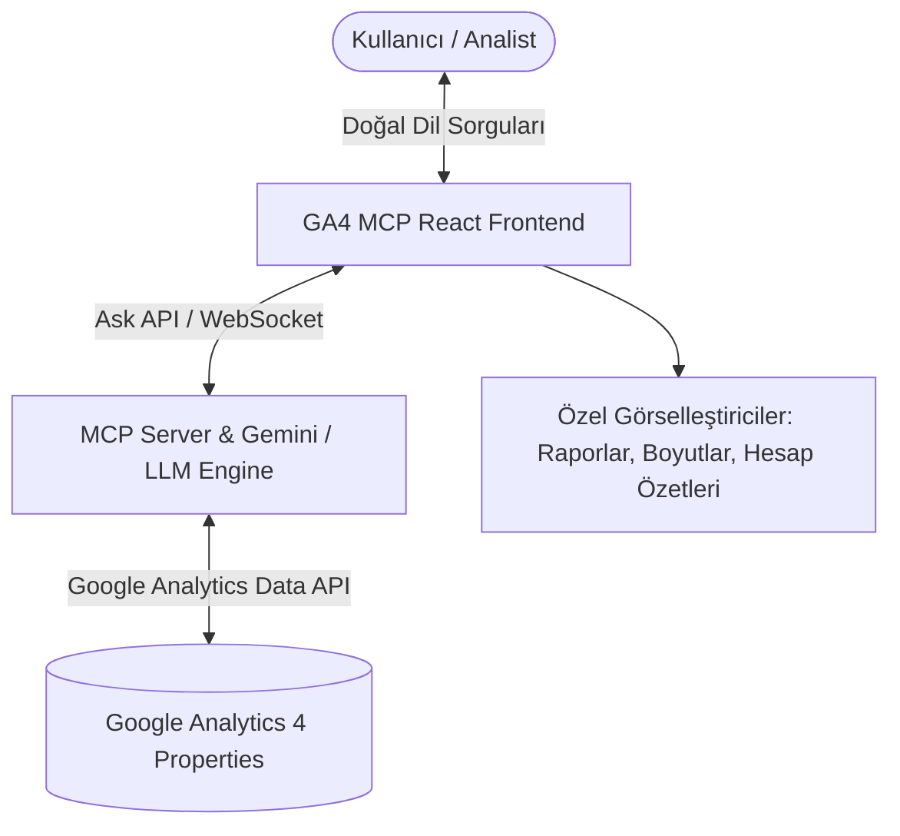

# 📊 GA4 MCP Chat - Google Analytics 4 AI Analytics Assistant

[](https://www.typescriptlang.org/)
[](https://reactjs.org/)
[](https://vitejs.dev/)
[](https://modelcontextprotocol.io/)
[](https://developers.google.com/analytics)
[](https://www.yucelgumus.dev/)

> **Google Analytics 4 (GA4)** verilerini Model Context Protocol (MCP) ve yapay zeka ajanları ile doğal dilde sorgulayan, anlık raporlar oluşturan ve verileri interaktif grafiklerle görselleştiren modern analitik web arayüzü.

---

## 🌟 Öne Çıkan Özellikler

- 💬 **Doğal Dil ile GA4 Sorgulama:** Karmaşık analitik raporlama terimlerine gerek kalmadan *"Geçen haftanın en çok ziyaret edilen sayfaları neler?"* gibi doğal dilde sorular sorun.
- 🔌 **Model Context Protocol (MCP) Entegrasyonu:** LLM ajanlarının Google Analytics Data API ile güvenli ve standart bir protokol üzerinden konuşmasını sağlar.
- 📊 **Özelleştirilmiş Veri Renderer Bileşenleri:**
  - `AccountSummariesRenderer`: GA4 hesap ve mülk (Property) hiyerarşisinin dökümü.
  - `GA4ReportRenderer`: Metrik ve boyut (Dimensions/Metrics) tabloları ve grafiksel özetler.
  - `CustomDimensionsRenderer`: Özel boyut ve parametre eşleştirmeleri.
  - `GenericJsonRenderer`: Dinamik ve ham JSON çıktıları için filtrelenebilir JSON görselleştirici.
- ⚡ **Yüksek Hızlı Vite & React 18 Mimarisi:** TypeScript tip güvenliği ve anlık arayüz güncellemeleri.
- 🎨 **Responsive & Temiz Kullanıcı Arayüzü:** Masaüstü ve mobil ekranlara tam uyumlu modern analitik paneli.

---

## 🏗️ Mimari & Teknoloji Yığını



| Kategori | Teknoloji / Kütüphane | Açıklama |
| :--- | :--- | :--- |
| **Frontend Framework** | React 18 + TypeScript | Modüler bileşen yapısı ve tip güvenliği |
| **Build Tool** | Vite | Ultra hızlı geliştirme ve üretim derlemesi |
| **Protokol / Entegrasyon** | Model Context Protocol (MCP) | LLM araç çağrıları (Tool Calling) ve veri akışı |
| **Veri Kaynağı** | Google Analytics 4 Data API | Gerçek zamanlı ve geçmiş oturum, dönüşüm ve trafik metrikleri |
| **Styling & Icons** | Modern CSS & SVG Icons | Optimize edilmiş hafif stiller ve ikonlar |

---

## 🚀 Hızlı Başlangıç

### Gereksinimler
- **Node.js**: v18.0 veya üzeri
- **npm** ya da **yarn** / **pnpm**
- Yapılandırılmış bir MCP Backend servisi veya GA4 API anahtarı

### Kurulum

```bash
# Depoyu klonlayın
git clone https://github.com/yucel-gumus/GA4_MCP_Chat.git
cd GA4_MCP_Chat/mcp_frontend

# Bağımlılıkları yükleyin
npm install

# Geliştirme sunucusunu başlatın
npm run dev
```

Uygulama varsayılan olarak `http://localhost:5173` adresinde çalışacaktır.

### Üretim Derlemesi (Production Build)

```bash
npm run build
npm run preview
```

---

## 📂 Proje Dizin Yapısı

```
GA4_MCP_Chat/
├── vercel.json
├── mcp_frontend/
│   ├── index.html
│   ├── package.json
│   ├── tsconfig.json
│   ├── vite.config.ts
│   └── src/
│       ├── main.tsx
│       ├── App.tsx
│       ├── api/
│       │   └── ask.ts                  # MCP sorgu istek katmanı
│       └── features/chat/
│           ├── components/
│           │   ├── ChatPage.tsx        # Ana sohbet penceresi
│           │   └── renderers/          # GA4'e özel veri renderer'ları
│           │       ├── GA4ReportRenderer.tsx
│           │       ├── AccountSummariesRenderer.tsx
│           │       ├── CustomDimensionsRenderer.tsx
│           │       └── GenericJsonRenderer.tsx
│           ├── hooks/
│           │   └── useAskApi.ts        # Chat state & API entegrasyon kancası
│           └── utils/
│               └── filterAnalyticsData.ts
```

---

## 📄 Lisans
Bu proje [MIT Lisansı](LICENSE) ile korunmaktadır.

---

## 👨‍💻 Geliştirici & İletişim

**Yücel Gümüş** - Full Stack Developer

- 🌐 **Web Sitesi / Portfolyo:** [yucelgumus.dev](https://www.yucelgumus.dev/)
- 💼 **LinkedIn:** [linkedin.com/in/yucel-gumus](https://www.linkedin.com/in/yucel-gumus/)
- 🐙 **GitHub:** [@yucel-gumus](https://github.com/yucel-gumus)

<p align="left">
  <a href="https://www.yucelgumus.dev/" target="_blank" rel="noopener noreferrer">
    
  </a>
</p>